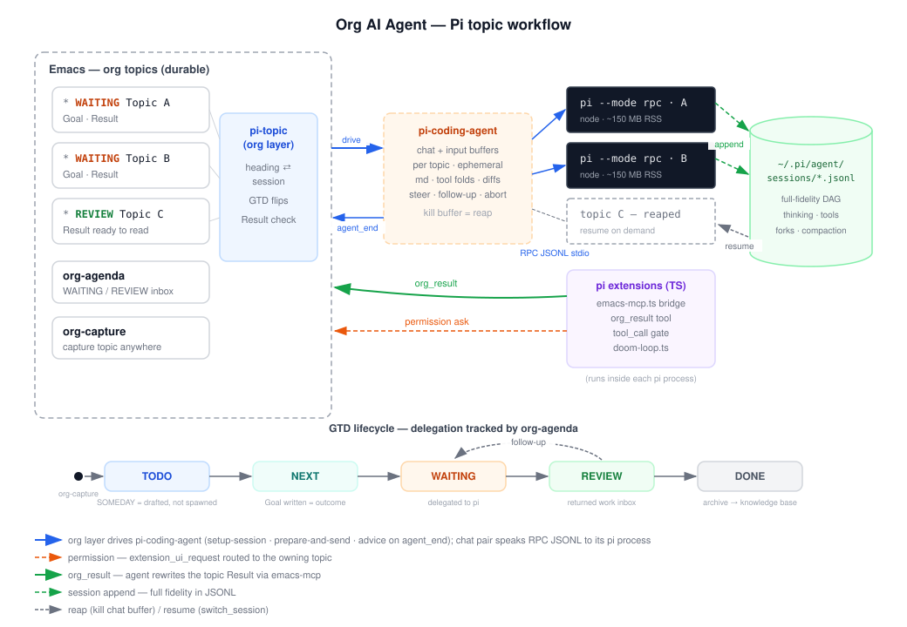

#+TITLE: emacs-agent — org headings as concurrent AI agent topics

Turn any org heading into a task you delegate to an AI agent, then get
back a distilled answer in the same outline.  The conversation runs in
a real chat buffer while it happens; what survives in org is the part
worth keeping — what you asked, and what came back.

Under the hood: [[https://pi.dev][Pi]] is the agent engine, [[https://github.com/dnouri/pi-coding-agent][pi-coding-agent]] owns the chat
UI, and this repo adds the org layer plus an MCP server that lets any
agent reach into Emacs.  Sources are literate org files loaded directly
by [[https://github.com/jingtaozf/literate-elisp][literate-elisp]] — the =.org= file IS the source, there is no tangle
step for the Elisp.

* Requirements

| Component | Minimum | Why |
|-----------+---------+-----|
| Emacs | 29.1 | =pi-coding-agent= needs tree-sitter for its markdown rendering |
| [[https://pi.dev][Pi CLI]] | 0.75.5 | =npm i -g @earendil-works/pi-coding-agent=, then =pi --login= |
| [[https://github.com/dnouri/pi-coding-agent][pi-coding-agent]] | 2.6.0 | the chat engine — MELPA: =M-x package-install RET pi-coding-agent= |
| [[https://github.com/jingtaozf/literate-elisp][literate-elisp]] | 0.8 | loads the =.org= sources |
| [[https://github.com/eschulte/emacs-web-server][web-server]] | 0.1.2 | only for the MCP server |

Version note: this layer calls six *private* =pi-coding-agent=
functions, because the public API cannot address a named session — the
one thing a per-topic model needs most ([[file:tasks/pi-topic-embed-map.md][tasks/pi-topic-embed-map.md]]
records what each is for).  Every one is checked by name at startup, so
an incompatible upgrade fails loudly rather than misbehaving quietly,
and =make test-pi-topic= re-checks them.  Verified against 2.6.0 and
2.7.0.

* Setup

#+begin_src elisp
(add-to-list 'load-path "~/projects/emacs-agent")
(require 'code-agent)      ; MCP server + trace macros + the pi-topic layer
#+end_src

That is enough to create and run topics.  Two optional extras:

#+begin_src elisp
;; 1. Let the agent write its own Result back into org (see below).
(emacs-mcp-server-start)   ; HTTP server at localhost:9999

;; 2. Capture a topic from anywhere with C-c c p.
(pi-topic-add-capture-template)
#+end_src

Capture asks where to file the topic the first time you use it,
offering =topics.org= at the current project root, and reuses your
answer for the rest of the session.  Pin it if you would rather not be
asked:

#+begin_src elisp
(setq pi-topic-file "~/org/topics.org")          ; always this file
(setq pi-topic-file (lambda () (my-topic-file))) ; or compute one
#+end_src

For the write-back path, tangle the Pi-side extension once:

#+begin_src bash
make tangle-pi-extensions   # → ~/.pi/agent/extensions/{emacs-mcp,doom-loop}.ts
#+end_src

* Tutorial — your first topic

*1. Create it.*  In any org file, =M-x pi-topic-new=.  You get a
skeleton with point waiting on the Goal line:

#+begin_example
,* Untitled topic
  :PROPERTIES:
  :PI_STATE: todo
  :END:
,** Goal
   Describe the desired outcome here.     ← replace this
,** Result
#+end_example

Write what you actually want.  The Goal is the brief you hand to the
agent, so state the outcome, not the steps: /"Compare pgvector and
qdrant for a 1M-row store, p95 under 50 ms; recommend one."/

*2. Send it.*  =M-x pi-topic-chat= with point anywhere inside the
topic.  A Pi session starts, the Goal is sent as the opening prompt,
and the frame splits: your org file on the left, the chat above its
input window on the right.  The heading flips to =waiting=.

*3. Ignore it.*  This is delegated work — you are not supposed to watch
it stream.  Go do something else.  Come back to the chat buffer when
you want to steer (=C-c C-s=), queue a follow-up (just type and =C-c
C-c=), or read the reasoning.

*4. Read the answer.*  When the turn finishes the heading flips to
=review=, and — if you enabled the write-back path — the Result section
holds the agent's own distillation:

#+begin_example
,* REVIEW Untitled topic
  :PROPERTIES:
  :PI_STATE:   review
  :PI_TOPIC_ID: pi-1786699072-07dx
  :PI_SESSION: ~/.pi/agent/sessions/…/2026-08-14T09-17-54Z_019fff90.jsonl
  :END:
,** Goal
   Decide whether to use SQLite or Postgres for a 500-row config store.
,** Result
   SQLite — 500 rows of single-user config need none of Postgres's
   concurrency, network service or operational surface.

   Decided: SQLite.  Rejected: Postgres — deployment and maintenance
   cost buys nothing at this size.
#+end_example

*5. Close it.*  Happy → =M-x pi-topic-set-state RET done=, then archive
the subtree as usual.  Not happy → keep chatting; the next turn flips
it back to =review= again.

Nothing is lost when you close the chat buffer: the full transcript
lives in the session file named by =PI_SESSION=.  =M-x pi-topic-chat=
on the same heading later resumes that exact session, history and all,
without re-sending the Goal.

* Commands

| Command | What it does |
|---------+--------------|
| =pi-topic-new= | Insert a topic skeleton at point (sibling of the heading you are in) |
| =pi-topic-chat= | Start or resume this topic's session; first run sends the Goal |
| =pi-topic-abort= | Stop the running turn |
| =pi-topic-refresh-result= | Ask the agent to bring the Result section up to date — costs one turn |
| =pi-topic-reap= | Kill the chat session, keep the heading and its =PI_SESSION= |
| =pi-topic-set-state= | Pick a lifecycle state by hand |
| =pi-topic-list= | =*Pi Topics*= — every topic across your files, ordered by state |
| =pi-topic-menu= | Transient menu over all of the above |

Bind the menu wherever you like:

#+begin_src elisp
(global-set-key (kbd "C-c p") #'pi-topic-menu)
#+end_src

* The org contract

A heading is a topic when it carries =PI_STATE=.  That is the whole
opt-in — no minor mode, no dedicated file, no mandatory keyword set.
Topics live in whatever org file you put them in; =pi-topic-file= only
decides where =org-capture= drops *new* ones, and it asks rather than
guessing unless you have set it.

| Property | Written by | Meaning |
|----------+------------+---------|
| =PI_STATE= | this layer | Lifecycle state — the source of truth |
| =PI_TOPIC_ID= | this layer | Stable session name; also passed to Pi as an env var |
| =PI_SESSION= | this layer | Absolute path of the Pi session JSONL — the full transcript |
| =PI_CWD= | you (optional) | Working directory; defaults to the file's project root |
| =PI_MODEL= | you (optional) | Pin a model for this topic |

Three sections, and only three: the *heading* names the outcome, *Goal*
is yours, *Result* is the agent's.  There is deliberately no transcript
in org — it already exists twice, in the chat buffer and in the session
file, and a third copy would be bulk nobody reads.

* GTD — a topic is delegated work

The lifecycle is David Allen's delegation loop: you capture, you write
the desired outcome, you hand it off, it comes back for review.  In a
file that defines the matching keywords, the state is mirrored onto the
TODO keyword, which is what makes org-agenda a delegation dashboard:

#+begin_src org
#+TODO: SOMEDAY(s) TODO(t) NEXT(n) WAITING(w!) REVIEW(r!) | DONE(d!) CANCELLED(c@)
#+end_src

| GTD | Here |
|-----+------|
| Capture → in-box | =C-c c p=, or =pi-topic-new= where you stand |
| Desired outcome | the Goal section — required before delegating |
| Waiting-for | =waiting=: the agent has it; track, do not watch |
| In-box of returned work | =review=: read Result, accept or push back |
| Someday/maybe | a topic with a Goal you never chat |
| Projects | a parent heading with child topics under it |
| Weekly review | =pi-topic-list=, or an agenda view over =pi-topic-agenda-files= |

Files without those keywords lose only the agenda view; the property
still drives everything.

* How the agent writes Result

Optional, and worth it — this is what makes a topic readable weeks
later.  Three pieces:

1. =emacs-mcp-server-start= — the bridge Pi calls back through.
2. =make tangle-pi-extensions= — installs =org_result= / =org_goal=
   tools into =~/.pi/agent/extensions/emacs-mcp.ts=.
3. Nothing else: when a session belongs to a topic, =PI_TOPIC_ID= is in
   its environment, the tools register themselves, and a system-prompt
   line asks the agent to keep Result current — conclusion first,
   decision and rejected alternative, links to the files that matter.

Outside a topic (a terminal =pi= session, someone else's project) the
env var is absent, the tools never register, and nothing changes.

=org_goal= exists too, but the agent is told to use it *only* when you
explicitly ask it to sharpen the goal.  Your brief stays yours.

* What's here

| Path | Role |
|------+------|
| =lp/org/pi-topic.org= | Topic identity, =PI_STATE= lifecycle, Goal/Result sections |
| =lp/org/pi-topic-chat.org= | Session engine: spawn, resume, display, turn-finished hook |
| =lp/org/pi-topic-io.org= | Find a topic by id and write a section back |
| =lp/org/pi-topic-workflow.org= | Capture, agenda files, =*Pi Topics*=, transient menu |
| =lp/sdk/emacs-mcp-server.org= | MCP server: =evalElisp=, =report_invocation= |
| =lp/backend/code-agent-pi-extensions.org= | Pi-side TS extensions (tangled) |
| =lp/trace/code-agent-trace.org= | OTel span macros |
| =lp/_drafts/draft.org= | Design record: the pi-topics + platform proposals |
| =tasks/pi-topic-embed-map.md= | Which upstream API each embed point uses |

Also here: the MCP server stands alone.  Point any MCP client at it —
=claude mcp add --transport http emacs http://localhost:9999/mcp= — and
that agent can read buffers, org properties and evaluate Elisp.

* Development

#+begin_src bash
make check        # lint + all unit tests — the pre-commit gate
make test-pi-topic  # just the pi-topic layer
#+end_src

=CLAUDE.md= holds the agent-facing rules, =ARCHITECTURE.org= the module
map, =lp/_drafts/draft.org= the design decisions and why the rejected
alternatives were rejected.

* Known limits

- Six private =pi-coding-agent= functions are in the dependency path, by
  choice: the public API cannot address a named session.  Guarded by
  name at startup; check =make test-pi-topic= after upgrading it.
- Thinking blocks and tool output stay in the chat buffer by design;
  org gets the outcome only.
- One Pi process per running topic (~150 MB, ~1 s to start).  Ten
  concurrent topics is comfortable; reap the idle ones with
  =pi-topic-reap= and resume them later from =PI_SESSION=.
- The repo was narrowed on 2026-08-13; the previous generation
  (cmux/tmux/orca backends, python bridge, IDE bridge) lives on the
  =legacy-2026-08-13= branch.
